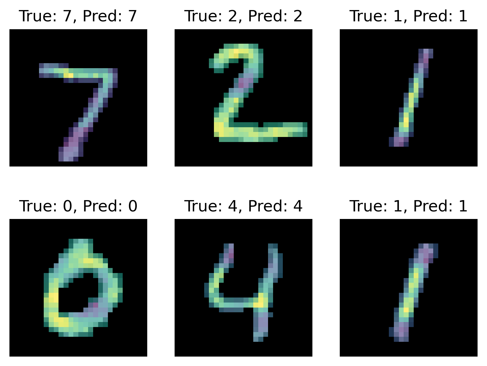

# vanilla-cnn
Convolutional neural network implemented in Numpy and Numba from scratch.

Implementation contains forward and backward passes of standard convolutional net operations: convolution, maxpool, flatten and dense feedforward. The model can be trained using stochastic gradient descent.

As a test, model was fitted to MNIST data [3] with standard train/test split. Using the most basic setup, 95% test accuracy was achieved. Below image demonstrates integrated gradients [4] of network for 6 test examples, which network has never seen during training.

As one can see, the net has positive(yellow color) response to pixels located in characteristic parts of chosen digits(e.g. upper bar for 7 or upper and lower curves for 2 etc.).

Sources:

[1] Michael A. Nielsen, "Neural Networks and Deep Learning", Determination Press, 2015, [http://neuralnetworksanddeeplearning.com/](http://neuralnetworksanddeeplearning.com/)

[2] Numba documentation, [https://numba.pydata.org/numba-doc/dev/index.html](https://numba.pydata.org/numba-doc/dev/index.html)

[3] Yann LeCun, Corinna Cortes and Christopher J.C. Burges, "The MNIST Database", [https://yann.lecun.com/exdb/mnist/](https://yann.lecun.com/exdb/mnist/)

[4] Mukund Sundararajan, Ankur Taly and Qiqi Yan, "Axiomatic Attribution for Deep Networks", [https://arxiv.org/pdf/1703.01365](https://arxiv.org/pdf/1703.01365)
