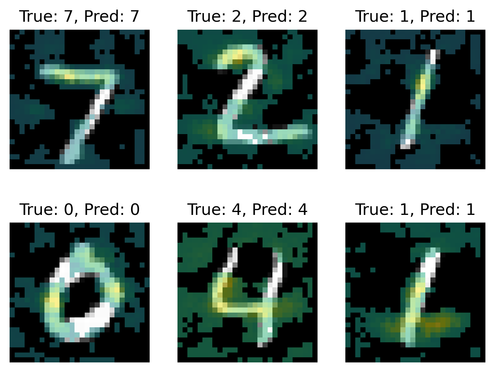

# vanilla-cnn
Convolutional neural network implemented in Numpy and Numba from scratch.

Implementation contains forward and backward passes of standard convolutional net operations: convolution, maxpool, flatten and dense feedforward. The model can be trained using stochastic gradient descent.

As a test, model was fitted to MNIST data with standard train/test split. Using the most basic setup, 95% test accuracy was achieved. Here is a gradient of loss function by input pixels for 6 samples, coming from the test data.

As one can see, the net is most responsive to pixels of digits or parts of background, where presence of active(white) pixels can be important for prediction.

Sources:

[1] Michael A. Nielsen, "Neural Networks and Deep Learning", Determination Press, 2015, [http://neuralnetworksanddeeplearning.com/](http://neuralnetworksanddeeplearning.com/)

[2] A ~5 minute guide to Numba, [https://numba.pydata.org/numba-doc/dev/user/5minguide.html](https://numba.pydata.org/numba-doc/dev/user/5minguide.html)

[3] Yann LeCun, Corinna Cortes and Christopher J.C. Burges, The MNIST Database, [https://yann.lecun.com/exdb/mnist/](https://yann.lecun.com/exdb/mnist/)
